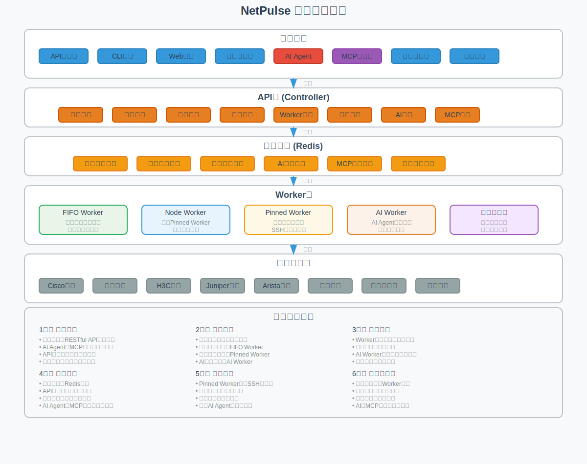

# NetPulse

[](https://hub.docker.com)
[](https://python.org)
[](LICENSE)

简体中文 | [English](README.md)

NetPulse 是一个高性能的分布式网络设备管理 API 框架。它通过创新的长连接技术提供统一接口，并通过插件机制无缝集成 Netmiko、NAPALM 等主流开源工具和厂商 API，让网络设备管理变得简单、高效、可靠。

## 为什么选择 NetPulse？


## 系统特性

* **高性能**: 通过持久化SSH连接技术，使设备连接响应速度和成功率大幅提升，资源消耗降低。相比传统的逐次建连方式，NetPulse 可以将设备操作响应时间从 2-5 秒降低到 0.5-0.9 秒。

* **分布式架构**: 采用可扩展的多主节点设计，支持横向扩展。每个节点都可以独立处理设备连接和命令执行，通过 Redis 集群实现节点间的任务协调，系统可基于docker和k8s部署实现高可用性。

* **统一接口**: 提供统一的 RESTful API，屏蔽不同厂商设备的差异。无论是 Cisco、华为还是其他厂商的设备，都可以通过相同的 API 接口进行操作，大大简化了网络自动化的开发工作。

### 技术架构



### 插件系统

NetPulse 提供了强大的插件系统，支持多种功能扩展：

* **设备驱动**: 
  - 支持 Netmiko (Cisco/Huawei/Juniper等)
  - 支持 NAPALM (配置管理/状态检查)
  - 支持自定义协议扩展

* **模板引擎**: 
  - Jinja2 配置模板
  - TextFSM/TTP 结构化解析
  - 自定义解析器支持

* **调度器**: 负载均衡、设备亲和性、自定义策略

* **Webhook**: 事件通知、外部触发、数据同步

## 快速开始

NetPulse 提供了详细的文档，包括快速入门、架构说明、API参考和最佳实践等。完整文档即将发布到 readthedocs，目前您可以查看以下内容：

* [快速入门](docs/zh/getting-started/quick-start.md) - 5分钟上手指南
* [架构设计](docs/zh/architecture/overview.md) - 系统架构说明
* [API 参考](docs/zh/guides/api/README.md) - 完整的 API 文档
* [插件开发](docs/zh/development/README.md) - 插件开发指南
* [部署指南](docs/zh/getting-started/deployment.md) - 详细的部署文档

### Docker 一键部署

```bash
# 克隆项目
git clone https://github.com/netpulse/netpulse.git
cd netpulse

# 一键部署
bash ./scripts/docker_deploy.sh
```

### 手动配置部署

```bash
# 1. 生成环境配置
bash ./scripts/check_env.sh generate

# 2. 配置必要的环境变量
cat << EOF > .env
NETPULSE_REDIS__PASSWORD=your_secure_redis_password
NETPULSE_SERVER__API_KEY=your_secure_api_key
TZ=Asia/Shanghai
EOF

# 3. 启动服务
docker compose up -d
```

## 基础示例

以下是一些常用操作的示例：

### 添加设备
```bash
curl -H "Authorization: Bearer $API_KEY" \
     -H "Content-Type: application/json" \
     -X POST http://localhost:9000/devices \
     -d '{
       "hostname": "192.168.1.1",
       "username": "admin",
       "password": "password123",
       "device_type": "cisco_ios"
     }'
```

### 执行命令
```bash
curl -H "Authorization: Bearer $API_KEY" \
     -H "Content-Type: application/json" \
     -X POST http://localhost:9000/commands \
     -d '{
       "device_id": "dev_1234567890",
       "commands": ["show version", "show interfaces"]
     }'
```

## 参与贡献

我们欢迎任何形式的贡献！以下是参与项目的方式：

1. Fork 本仓库
2. 创建您的特性分支 (`git checkout -b feature/AmazingFeature`)
3. 提交您的改动 (`git commit -m 'Add some AmazingFeature'`)
4. 推送到分支 (`git push origin feature/AmazingFeature`)
5. 创建一个 Pull Request

详细信息请参考 [贡献指南](CONTRIBUTING.md)。

## 开源协议

本项目采用 MIT 协议 - 详见 [LICENSE](LICENSE) 文件。

## 作者

* **Locus Li** – 项目负责人
* **Yongkun Li** – 首席开发者

查看 [AUTHORS.md](AUTHORS.md) 了解所有贡献者信息。

---

**NetPulse** - 让网络设备管理更简单、更高效、更可靠。 