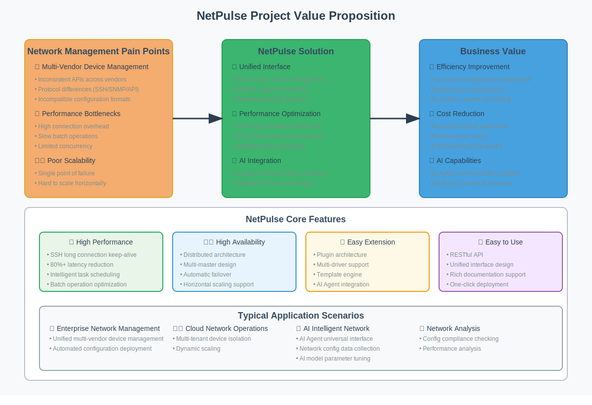
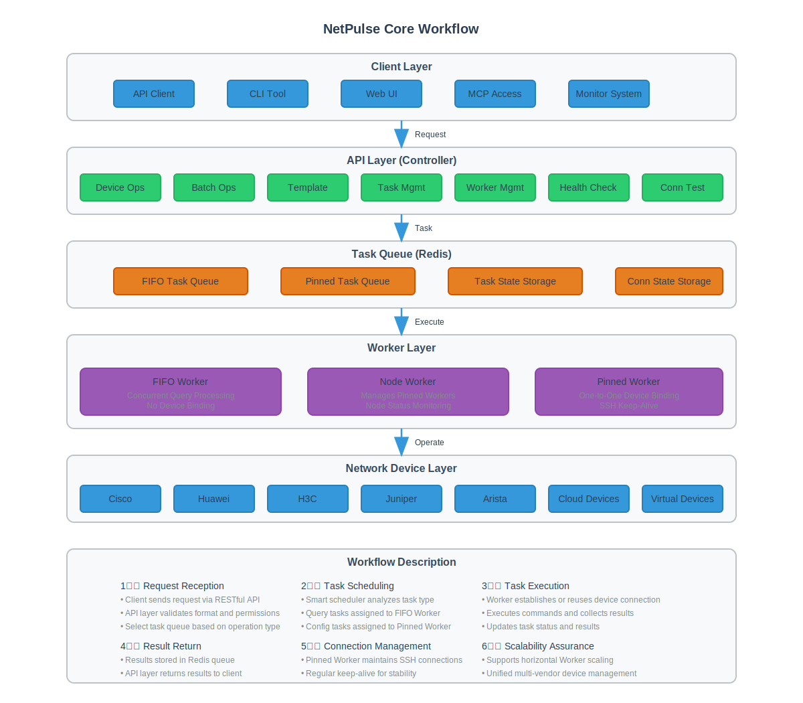

# NetPulse

[](https://hub.docker.com)
[](https://python.org)
[](LICENSE)

[简体中文](README-zh.md) | English

NetPulse is a high-performance distributed network device management API framework. Through innovative persistent connection technology and unified interfaces, it seamlessly integrates with mainstream tools like Netmiko, NAPALM, and vendor APIs to make network device management simple, efficient, and reliable.

## Why NetPulse?



## System Features

* **High Performance**: Utilizing persistent SSH connections to significantly improve device connection response time and success rate while reducing resource consumption. Compared to traditional connection methods, NetPulse reduces device operation response time from 2-5 seconds to 0.5-0.9 seconds.

* **Distributed Architecture**: Adopts a scalable multi-master node design supporting horizontal scaling. Each node independently handles device connections and command execution, with Redis cluster enabling task coordination. The system achieves high availability through Docker and Kubernetes deployment.

* **Unified Interface**: Provides a unified RESTful API that abstracts vendor-specific differences. Whether it's Cisco, Huawei, or other vendors' devices, they can all be operated through the same API interface, greatly simplifying network automation development.

### Technical Architecture



### Plugin System

NetPulse offers a powerful plugin system supporting various functional extensions:

* **Device Drivers**: 
  - Netmiko support (Cisco/Huawei/Juniper etc.)
  - NAPALM support (Configuration management/State verification)
  - Custom protocol extension support

* **Template Engine**: 
  - Jinja2 configuration templates
  - TextFSM/TTP structured parsing
  - Custom parser support

* **Scheduler**: Load balancing, device affinity, custom strategies

* **Webhook**: Event notification, external triggers, data synchronization

## Quick Start

NetPulse provides comprehensive documentation including quick start guides, architecture explanations, API references, and best practices. The complete documentation will be available on readthedocs soon. Currently, you can refer to:

* [Quick Start](docs/en/getting-started/quick-start.md) - 5-minute guide
* [Architecture](docs/en/architecture/overview.md) - System architecture
* [API Reference](docs/en/guides/api/README.md) - Complete API documentation
* [Plugin Development](docs/en/development/README.md) - Development guide
* [Deployment Guide](docs/en/getting-started/deployment.md) - Detailed deployment instructions

### Docker Quick Deploy

```bash
# Clone the repository
git clone https://github.com/netpulse/netpulse.git
cd netpulse

# One-click deployment
bash ./scripts/docker_deploy.sh
```

### Manual Configuration

```bash
# 1. Generate environment configuration
bash ./scripts/check_env.sh generate

# 2. Configure essential environment variables
cat << EOF > .env
NETPULSE_REDIS__PASSWORD=your_secure_redis_password
NETPULSE_SERVER__API_KEY=your_secure_api_key
TZ=Asia/Shanghai
EOF

# 3. Start the service
docker compose up -d
```

## Contributing

We welcome all forms of contributions! Here's how you can contribute:

1. Fork the repository
2. Create your feature branch (`git checkout -b feature/AmazingFeature`)
3. Commit your changes (`git commit -m 'Add some AmazingFeature'`)
4. Push to the branch (`git push origin feature/AmazingFeature`)
5. Create a Pull Request

For more details, please refer to our [Contributing Guide](CONTRIBUTING.md).

## License

This project is licensed under the MIT License - see the [LICENSE](LICENSE) file for details.

## Authors

* **Locus Li** – Project Owner
* **Yongkun Li** – Lead Developer

See [AUTHORS.md](AUTHORS.md) for a full list of contributors.

---

**NetPulse** - Making network device management simpler, more efficient, and more reliable. 