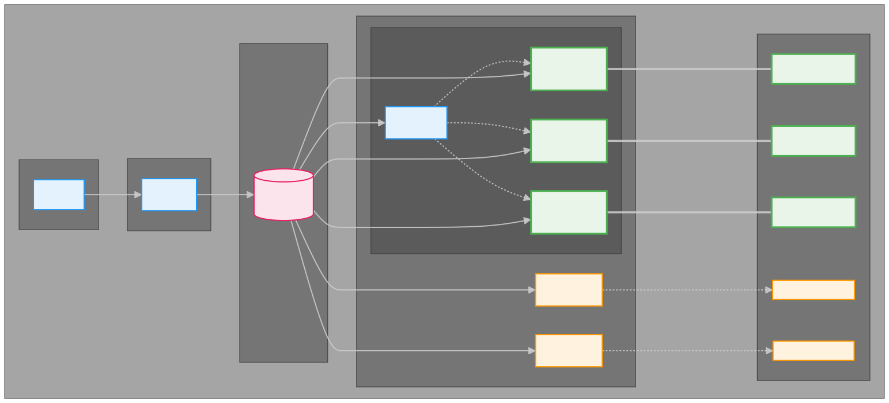

# 系统架构概览

NetPulse 采用现代化的分布式架构设计，提供高可用、高性能的网络设备管理服务。

## 整体架构

```mermaid
flowchart TB
    %% ─────────────────── Node Style Definitions ───────────────────
    classDef client fill:#F3E5F5,stroke:#8E24AA,stroke-width:2px;
    classDef api    fill:#9ce8e4,stroke:#05998b,stroke-width:2px;
    classDef queue  fill:#FFD3D0,stroke:#D82C20,stroke-width:3px;
    classDef nodew   fill:#E6F4EA,stroke:#4B8B3B,stroke-width:2px;       %% olive green
    classDef fifow   fill:#FDF6E3,stroke:#C29F48,stroke-width:2px;      %% beige
    classDef pinnedw fill:#E6F2FA,stroke:#3D7E9A,stroke-width:2px;      %% soft blue


    %% ─────────────────── Clients (forced horizontal) ───────────────
    subgraph clients [Clients]
        A1[API Client 1]:::client
        A2[API Client 2]:::client
        A3[API Client 3]:::client
        %% helper edges to keep same rank
        A1 --- A2
        A2 --- A3
    end

    %% ─────────────────── API Layer ────────────────────────────────
    subgraph apis [API Servers]
        direction LR
        B1[Controller 1]:::api
        B2[Controller 2]:::api
        B3[Controller 3]:::api
        B1 --- B2
        B2 --- B3
    end

    %% ─────────────────── Redis Queue ──────────────────────────────
    C(["Redis Job Queue"]):::queue

    %% ─────────────────── Worker Layer ─────────────────────────────
    subgraph workers [Workers]
        subgraph W1 [FIFO Worker]
            D1[FIFO Worker → Devices]:::fifow
        end
        subgraph W2 [Node Worker]
            D2[Node Worker]:::nodew
            subgraph pinned [Pinned Workers]
                P1[Pinned Worker → Device 1]:::pinnedw
                P2[Pinned Worker → Device 2]:::pinnedw
            end
        end
    end

    %% ─────────────────── Connections ──────────────────────────────
    clients -->|HTTP Requests| apis
    apis -->|Scheduling| C
    C -->|Async Jobs| D1
    C -->|Async Jobs| D2
    D2 -->|Managed| P1
    D2 -->|Managed| P2

    %% ─────────────────── Subgraph Styles ──────────────────────────
    style clients fill:#FDF8FF,stroke:#C5A3E0,stroke-width:2px,stroke-dasharray:4 4
    style apis    fill:#E0F7FA,stroke:#05998b,stroke-width:2px,stroke-dasharray:4 4
    style workers fill:#FCFCFA,stroke:#CCCCCC,stroke-width:2px,stroke-dasharray:4 4
    style W1 fill:#FBF9F2,stroke:#CBBE9A,stroke-width:1.5px
    style W2 fill:#F1F8E9,stroke:#66BB6A,stroke-width:1.5px
    style pinned fill:#F0F7FA,stroke:#7DAFC5,stroke-width:1.5px


    %% ─────────────────── Hide invisible helper edges ─────────────
    linkStyle 0,1,2,3 stroke-width:0px;
    linkStyle 4,5,6,7,8,9 stroke-width:2px;

```

## 设计理念

NetPulse 的核心设计理念在于三种 Worker 的分工。

在网络运维工作中，通常具备两种任务：

- **查询性任务：** 拉取设备状态、检查配置信息等
- **修改性任务：** 推送和应用设备配置

```mermaid
graph LR
    classDef query fill:#FDF6E3,stroke:#C29F48,stroke-width:2px;      %% beige
    classDef config fill:#E6F2FA,stroke:#3D7E9A,stroke-width:2px;      %% soft blue

    QT[Query Tasks]:::query
    CT[Config Tasks]:::config

    Q1[Pulling Device Status]:::query
    Q2[Checking Configuration Information]:::query
    C1[Pushing and Applying Device Configurations]:::config

    QT --> Q1
    QT --> Q2
    CT --> C1
```

```mermaid
graph TD
    classDef note fill:#FFFFFF,stroke:#000000,stroke-dasharray: 5 5;  %% dashed box for notes

    Note1["<div style='width:300px'><b>Query Tasks</b><br>No specific execution order required</div>"]:::note
    Note2["<div style='width:300px'><b>Config Tasks</b><br>Predictable execution order required</div>"]:::note
```

这两种类型的任务，对操作者提出了不同的需求。简单而言，检查性任务往往不具备先后顺序，而修改性任务则必须保证在单台设备上的先后顺序。而且，用户往往期望查询性任务尽快执行，而修改性任务则容忍排队。这就导致我们必须设计两种 Worker：Pinned Worker 和 FIFO Worker。

Pinned Worker 专门负责连接一台设备，与设备保持一对一的关系。因此，当客户端向 Pinned Worker 发送任务时，可以保证任务在设备上严格按照先后顺序执行。这就使得 Pinned Worker 十分适合处理修改性的任务。

FIFO Worker 则没有与设备的绑定关系。一个系统中可以部署多个 FIFO Worker。多个 FIFO Worker 同时从 Redis 中取出任务，尽快执行。这种并行缩短了任务的排队时间，但也导致任务之间的顺序没有严格的保证。因此，FIFO Worker 很适合完成查询性的任务。

```mermaid
graph TD
    classDef pinnedw fill:#E6F2FA,stroke:#3D7E9A,stroke-width:2px;      %% soft blue
    classDef fifow fill:#FDF6E3,stroke:#C29F48,stroke-width:2px;      %% beige
    classDef nodew fill:#E6F4EA,stroke:#4B8B3B,stroke-width:2px;      %% olive green
    classDef device fill:#DCDCDC,stroke:#696969,stroke-width:2px;     %% gray 

    subgraph NodeWorker [Node / Container]
        NW[Node Worker]:::nodew

        subgraph PinnedWorkers [Pinned Workers]
            PW1[Pinned Worker]:::pinnedw
            PW2[Pinned Worker]:::pinnedw
        end
    end

    subgraph FIFOWorkers [FIFO Workers]
        FW1[FIFO Worker 1]:::fifow
        FW2[FIFO Worker 2]:::fifow
    end

    NW -->|Generates & Manages | PW1
    NW -->|Generates & Manages | PW2
    PW1 -->|Config / Query Tasks| Device1[Device 1]:::device
    PW2 -->|Config / Query Tasks| Device2[Device 2]:::device
    FIFOWorkers -->|Query Tasks| Device3[Device 3]:::device
    FIFOWorkers -->|Query Tasks| Device4[Device 4]:::device
    FIFOWorkers -->|Query Tasks| Device5[Device 5]:::device


    style NodeWorker fill:#F1F8E9,stroke:#66BB6A,stroke-width:1.5px
    style PinnedWorkers fill:#F0F7FA,stroke:#7DAFC5,stroke-width:1.5px
    style FIFOWorkers fill:#FBF9F2,stroke:#CBBE9A,stroke-width:1.5px
```

在部署时，我们可以预先启动指定数量的 FIFO Worker，但不可能预先启动 Pinned Worker，因为无法预知用户会对哪些设备进行操作。因此 Pinned Worker 必须动态生成，Node Worker 就是一种“守护进程”，用于在容器内、节点上动态生成 Pinned Worker。

除了上述基本的设计考量之外，我们进一步利用单个 Pinned Worker 只关联一台设备的特点，在 Pinned Worker 中实现了 SSH Session 的持久化，进一步提升了任务执行的稳定性、降低了延迟（参考 [SSH 保活](./drivers.md)）。

## 核心组件

1. **RESTful API**
    - 基于 FastAPI 构建
    - 处理传入请求、验证并排队任务

2. **消息队列**
    - 基于 Redis 的任务队列（基于 RQ）
    - 用于多主多从架构中的状态同步
    - 暂存任务状态、任务执行结果

3. **工作节点**
    - 设计了三种 Worker，处理不同类型的任务
    - FIFO 工作节点：按顺序处理任务
    - Node 工作节点：作为守护进程管理 Pinned Worker 和节点状态
    - Pinned 工作节点：维护和单个设备的连接，串行执行某设备的任务

4. **插件系统**
    - 可扩展的插件系统包含设备驱动、调度器、模板引擎和 Webhooks
    - 接口定义明确，便于二次开发和集成

## 数据流

### 1. 请求处理流程
```mermaid
sequenceDiagram
    participant Client as 客户端
    participant API as API Gateway
    participant Queue as 任务队列
    participant Worker as Worker Pool
    participant Device as 网络设备
    
    Client->>API: API请求
    API->>API: 认证验证
    API->>Queue: 任务入队
    Queue->>Worker: 任务分发
    Worker->>Device: 设备连接
    Device-->>Worker: 执行结果
    Worker-->>Queue: 结果返回
    Queue-->>API: 响应数据
    API-->>Client: API响应
```

### 2. 连接管理流程
```mermaid
sequenceDiagram
    participant API as API Gateway
    participant Pool as 连接池
    participant Manager as 连接管理器
    participant Device as 网络设备
    
    API->>Pool: 请求连接
    Pool->>Manager: 检查连接状态
    alt 连接存在且有效
        Manager-->>Pool: 返回现有连接
    else 需要新建连接
        Manager->>Device: 建立SSH连接
        Device-->>Manager: 连接成功
        Manager-->>Pool: 返回新连接
    end
    Pool-->>API: 返回连接
```

## 功能对比

相较于 NetPalm 等现有项目，NetPulse 具有以下显著优势：

### 功能精简

NetPulse 在设计之初就深入分析了业务需求，并充分考虑了功能的通用性。与 NetPalm 相比，NetPulse 专注于命令下发的核心功能，将模板管理、定时任务触发等辅助功能交由上层业务系统实现。这种精简化的设计理念使得 NetPulse 更易于维护，同时能够更好地融入现有的基础设施环境。

### 性能卓越

NetPulse 通过以下三个关键技术实现了显著的性能提升：

- **连接保活机制**：通过维持长连接，大幅减少了重复建立连接所带来的执行延迟，实现命令的快速下发。
- **多样化调度算法**：提供负载均衡和资源集中利用等多种调度策略，相比 NetPalm 单一的贪心算法，性能表现更加出色。
- **批量命令接口**：支持批次化命令下发，有效降低了大规模设备操作时的重复请求开销，结合分批调度算法，性能优势更加明显。

### 高可用性

NetPulse 提供基于 Kubernetes 和 Redis Sentinel 哨兵模式的企业级高可用部署方案，开箱即用，确保系统稳定运行。

### 可扩展性

NetPulse 设计了完善的插件架构，支持在驱动层、模板层、调度算法和 WebHook 四个维度进行灵活的自定义开发，满足不同场景的扩展需求。
